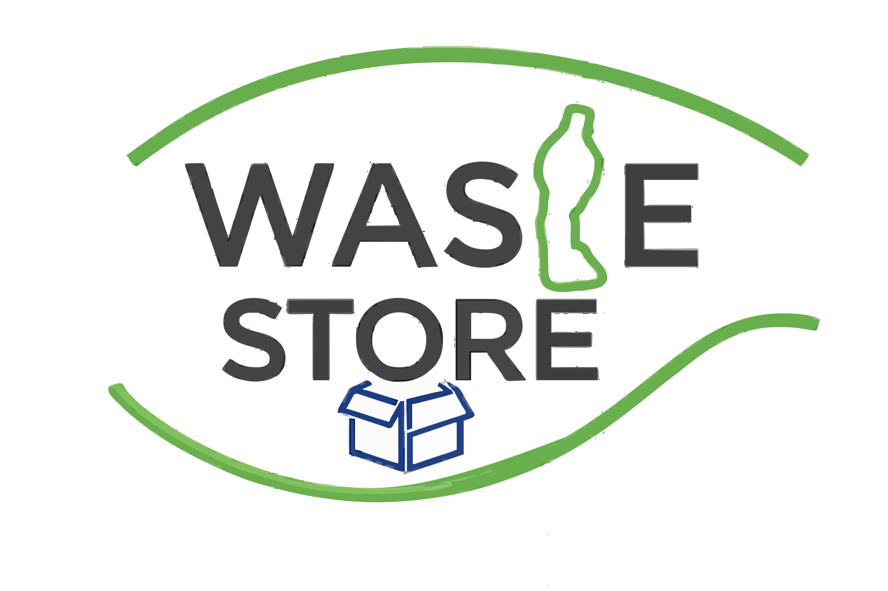

<p align="center">
  
</p>

<h1 align="center">Co-Workers Cloud — Kelab Platform</h1>

<p align="center">
  Marketplace SaaS para la economía circular y la gestión de residuos reciclables en Colombia.
</p>

<p align="center">
  
  
  
  
  
  
</p>

---

## ¿Qué es Co-Workers Cloud?

**Co-Workers Cloud** es una plataforma SaaS desarrollada por **R&R Kelab S.A.S** que conecta a los actores de la economía circular en Colombia: recicladores, transformadores, transportadores y administradores sectoriales.

La plataforma permite a cada actor gestionar su tienda, productos, inventario y perfil dentro de un ecosistema trazable y colaborativo, promoviendo el aprovechamiento de materiales reciclables y reduciendo el impacto ambiental de los residuos sólidos.

---

## Características principales

| Módulo | Descripción |
|---|---|
| 🏪 **Marketplace** | Tiendas por actor, catálogo de productos reciclables, estados de aprobación |
| 📦 **Inventario** | Control de stock, movimientos (entrada / salida / ajuste), alertas de stock mínimo |
| 👤 **Perfiles** | Gestión de perfil, avatar con iniciales, dirección, redes sociales |
| 🔐 **Autenticación** | JWT, roles por actor, cookies seguras |
| 🌙 **Tema** | Dark mode / Light mode completo |
| 📊 **Dashboard** | Métricas de inventario, movimientos recientes, gráficas de actividad |

---

## Stack tecnológico

### Backend
- **Java 17** + **Spring Boot 3.x**
- Spring Security + JWT
- Spring Data JPA + Hibernate
- MySQL / PostgreSQL
- Lombok, MapStruct

### Frontend
- **Next.js 14** (App Router)
- **TypeScript 5**
- **Tailwind CSS**
- `js-cookie` para manejo de tokens
- Lucide React para iconografía

---


## Roles de usuario

| ActorType | Descripción |
|---|---|
| `RECICLADOR` | Gestor de residuos, puede crear y gestionar su tienda |
| `TRANSFORMADOR` | Productor/transformador de materiales reciclados |
| `TRANSPORTADOR` | Operador logístico de la cadena |
| `ADMIN_SECTORIAL` | Administrador de una región o sector |
| `ADMIN_GENERAL` | Superadministrador de la plataforma |

Cada usuario puede ser `NATURAL` o `JURIDICA` (persona natural o empresa) y puede estar marcado como `afiliado`.


---

## Instalación y ejecución local

### Requisitos previos
- Java 17+
- Node.js 18+
- MySQL 8+ o PostgreSQL 14+
- Maven 3.8+

### Backend

```bash
# Clonar el repositorio
git clone https://github.com/rr-kelab/coworkers-cloud.git
cd coworkers-cloud/backend

# Configurar base de datos en application.properties
spring.datasource.url=jdbc:mysql://localhost:3306/kelab_cloud
spring.datasource.username=tu_usuario
spring.datasource.password=tu_contraseña

# Ejecutar
./mvnw spring-boot:run
# API disponible en http://localhost:8080
```

### Frontend

```bash
cd coworkers-cloud/frontend

# Instalar dependencias
npm install

# Variables de entorno
cp .env.example .env.local
# Edita NEXT_PUBLIC_API_URL=http://localhost:8080/api

# Ejecutar en desarrollo
npm run dev
# App disponible en http://localhost:3000
```

---

## Variables de entorno

### Frontend (`.env.local`)
```env
NEXT_PUBLIC_API_URL=http://localhost:8080/api
```

### Backend (`application.properties`)
```properties
spring.datasource.url=jdbc:mysql://localhost:3306/kelab_cloud
spring.datasource.username=root
spring.datasource.password=secret

jwt.secret=tu_clave_secreta_muy_larga
jwt.expiration=86400000

spring.jpa.hibernate.ddl-auto=update
```

---

## Usuarios de prueba

Puedes crear los siguientes usuarios de prueba usando `POST /api/auth/register`:

```json
{ "name": "EcoTransforma SAS",      "email": "transformador@demo.com",   "password": "123456", "tipoPersona": "JURIDICA", "actorType": "TRANSFORMADOR",   "afiliado": true  }
{ "name": "Carlos Reciclajes",       "email": "reciclador@demo.com",       "password": "123456", "tipoPersona": "NATURAL",   "actorType": "RECICLADOR",       "afiliado": true  }
{ "name": "TransCarga Logística SAS","email": "transportador@demo.com",    "password": "123456", "tipoPersona": "JURIDICA", "actorType": "TRANSPORTADOR",    "afiliado": false }
{ "name": "María Gestión Sectorial", "email": "admin.sectorial@demo.com",  "password": "123456", "tipoPersona": "NATURAL",   "actorType": "ADMIN_SECTORIAL",  "afiliado": false }
{ "name": "Kelab Admin",             "email": "admin@demo.com",            "password": "123456", "tipoPersona": "NATURAL",   "actorType": "ADMIN_GENERAL",    "afiliado": false }
```

---

## Contribuir

Este proyecto es **software propietario** de R&R Kelab S.A.S. No se aceptan contribuciones externas sin acuerdo previo firmado. Si eres parte del equipo, consulta la guía interna de desarrollo en la Wiki del repositorio.

---

## Licencia

Copyright © 2024-2025 **R&R Kelab S.A.S** — Todos los derechos reservados.

Este software es propietario y confidencial. Está prohibida su copia, distribución o modificación sin autorización expresa y por escrito de R&R Kelab S.A.S. Consulta el archivo [`LICENSE`](./LICENSE) para más detalles.

---

<p align="center">
  Hecho con ♻️ en Colombia por <strong>R&R Kelab S.A.S</strong>
</p>